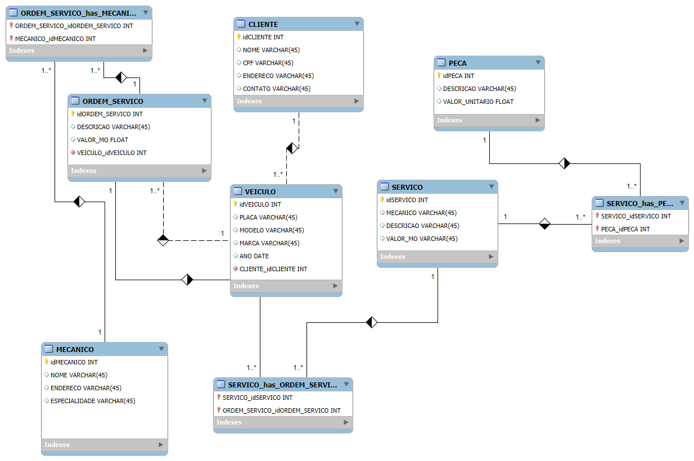

# 📊 Modelo EER do Banco de Dados

Este repositório contém o modelo entidade-relacionamento utilizado no projeto **E-commerce**.

## Diagrama

> O arquivo acima foi gerado a partir do MySQL Workbench e exportado em formato PNG.
